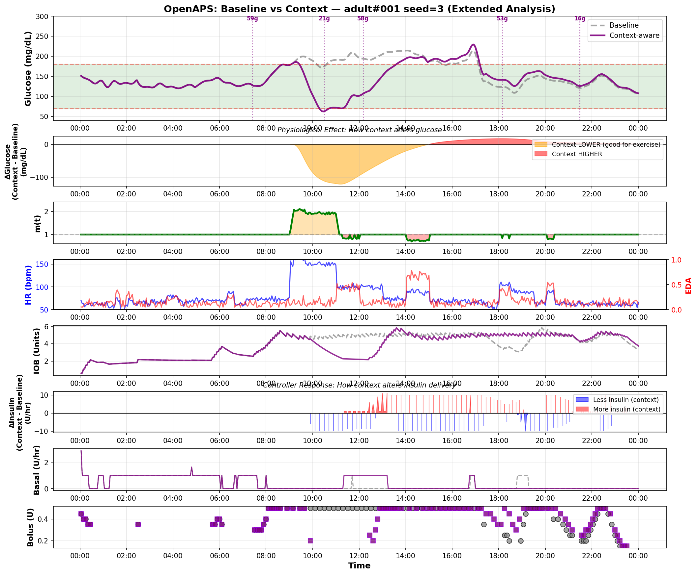

# SimGlucose Extension

**Exercise and stress dynamics for the [SimGlucose](https://github.com/jxx123/simglucose) Type 1 Diabetes simulator.**

[](https://www.python.org/downloads/)
[](https://opensource.org/licenses/MIT)
[](tests/)

## Features

✅ **Exercise detection** via heart rate → increased insulin sensitivity  
✅ **Stress detection** via electrodermal activity → decreased insulin sensitivity  
✅ **Physiologically-grounded** Vm0/Vmx modulation 
✅ **Drop-in compatibility** with existing SimGlucose code  
✅ **Safety features**: bounds, smoothing, rate limiting, hysteresis  
✅ **Comprehensive testing**: 27 unit + integration tests

## ⚠️ Important Disclaimers

**Research Tool Only:**
- ❌ Not for clinical use
- ❌ No medical device certification
- ❌ No FDA approval
- ❌ No HIPAA compliance

This tool is for **research and educational purposes only**. Never use for actual medical decision-making.

**Calibration Status:**
- Vm0 exponent (K=3.5) derived from exercise physiology literature (10-20× uptake)
- Not fitted to real patient data
- Theoretically grounded but not clinically validated


## Physiological Basis

This patch modulates standard UVA/Padova model parameters to reflect real-time physiology, bridging the gap between static simulation and dynamic reality.

### 1. Vm0 (Insulin-Independent Glucose Uptake)
* **Parameter:** `Vm0` represents basal glucose utilization by the brain and organs, plus non-insulin-mediated uptake by muscles.
* **Modulation:** We apply a **massive non-linear boost** ($m(t)^K$, where $K = 3.5$) during exercise.
* **Why:** 
    * *Physiology:* During vigorous exercise, whole-body glucose uptake increases by 10-20×, primarily driven by contraction-mediated (AMPK) pathways in muscle, independent of insulin. Linear scaling is insufficient to model this drain.
    * *Calibration:* Using theoretical max strategy: With alpha=1.25, theoretical $m_{max} = 2.25$. Targeting 17× boost: $K = \log(17) / \log(2.25) \approx 3.5$. This produces physiologically realistic glucose drops during exercise (40-50 mg/dL over 2h despite controller intervention).
* **Reference:** Richter et al. (1985); Sylow et al. (2017), *Physiological Reviews*.

### 2. Vmx (Insulin-Dependent Glucose Uptake)
* **Parameter:** `Vmx` represents the maximal rate of glucose uptake facilitated by insulin.
* **Modulation:** We apply **minimal scaling** ($m(t)^{0.2}$) during exercise.
* **Why:** 
    * *Math:* In the UVA/Padova model, the insulin action term $X(t)$ becomes negative when insulin is below basal (e.g., pump suspend). Strongly increasing `Vmx` in this state would amplify this negative term, potentially causing a mathematical artifact (negative total uptake).
    * *Strategy:* Since the `Vm0` boost already accounts for the massive glucose clearance, we keep `Vmx` conservative to maintain model stability during low-insulin states.
    * *Stress:* During stress ($m < 1$), we scale linearly, as stress induces genuine insulin resistance.

### 3. p2u (Insulin Action Kinetics)
* **Parameter:** `p2u` governs the rate constant of insulin action on glucose utilization.
* **Modulation:** Optionally scaled to simulate changes in insulin perfusion or action delay.

**Why the hybrid strategy (Vm0 exponential + Vmx minimal)?**

Early versions used linear scaling for both parameters. This was insufficient because:
- Exercise increases glucose uptake 10-20× via AMPK (insulin-independent pathway)
- Linear Vm0 scaling only gives 2× increase, contradicting physiology literature
- Linear Vmx scaling can cause mathematical artifacts when insulin drops below basal

The hybrid strategy addresses both issues:
1. Vm0 (insulin-independent): Exponential scaling (m^3.5) captures massive AMPK-mediated drain
2. Vmx (insulin-dependent): Minimal scaling (m^0.2) prevents negative uptake artifacts

See [API_REFERENCE.md](API_REFERENCE.md) for complete parameter documentation.

## Installation

### From GitHub (Recommended)

```bash
pip install git+https://github.com/Jipvoshol/simglucose_extension.git
```

### From Source (Development)

```bash
git clone https://github.com/Jipvoshol/simglucose_extension.git
cd simglucose_extension
pip install -e .
```

### Requirements

- Python >= 3.9
- SimGlucose >= 0.2.9
- pandas >= 1.0
- numpy >= 1.18
- scipy >= 1.11


## Visual Demonstration

The plot below demonstrates how the patch alters glucose dynamics compared to a standard simulation.
*   **Scenario:** 24h simulation with Exercise (9-11h), Stress (14-15h), and a Walk (18:30-19:30).
*   **Controller:** A simplified OpenAPS-inspired controller (PID basal + Meal Bolus).
*   **Observation:**
    *   **Exercise (Orange zone):** The context-aware patient (purple line) shows a significant glucose drop due to increased insulin sensitivity ($m > 1$) and non-insulin mediated uptake ($V_{m0}$ boost). The baseline patient (blue dashed) remains flat, ignoring the exercise.
    *   **Stress (Red zone):** The context-aware patient shows reduced insulin sensitivity ($m < 1$), leading to a higher glucose peak compared to baseline.


*Figure: Comparison of glucose dynamics with and without the context patch. Note how the controller (bottom panels) reacts differently to the altered physiology.*

## Quick Start

```python
import pandas as pd
from simglucose.patient.t1dpatient import T1DPatient
from simglucose.sensor.cgm import CGMSensor
from simglucose.actuator.pump import InsulinPump
from simglucose.simulation.scenario import CustomScenario
from simglucose.controller.base import Action

from simglucose_ctx.context import ContextStream, ContextConfig
from simglucose_ctx.env_wrapper import ContextAwareT1DSimEnv

# 1. Create synthetic HR/EDA data (or load from real sensors)
idx = pd.date_range('2025-01-01 06:00', periods=288, freq='5min')  # 24h
hr = pd.Series([70]*60 + [140]*48 + [70]*180, index=idx)  # Rest→Exercise→Rest
eda = pd.Series([0.1]*288, index=idx)

# 2. Create context stream
ctx = ContextStream(hr, eda, ContextConfig())

# 3. Create SimGlucose components
patient = T1DPatient.withName('adolescent#001')
sensor = CGMSensor.withName('Dexcom')
pump = InsulinPump.withName('Insulet')
scenario = CustomScenario(start_time=pd.Timestamp('2025-01-01 06:00'))

# 4. Wrap environment
env = ContextAwareT1DSimEnv(
    patient, sensor, pump, scenario,
    context_stream=ctx,
    modulate_vm0=True,   # Enable AMPK exercise effect
    modulate_vmx=True    # Enable insulin resistance modulation
)

# 5. Run simulation
env.reset()
for _ in range(100):
    action = Action(basal=patient._params.u2ss, bolus=0)
    obs, reward, done, info = env.step(action)
    print(f"Glucose: {obs.CGM:.1f} mg/dL, m(t): {info['context_m']:.2f}")
    if done:
        break
```

See [examples/](examples/) for complete runnable examples.

## Usage

A. Wrapper-based integration (no edits in SimGlucose)

```python
from simglucose_ctx.env_wrapper import ContextAwareT1DSimEnv
from simglucose_ctx.context import ContextStream, ContextConfig

# ctx = ContextStream(hr_series, eda_series, ContextConfig(...))
# env = ContextAwareT1DSimEnv(patient, sensor, pump, scenario,
#                             context_stream=ctx,
#                             modulate_vm0=True,
#                             modulate_vmx=True,
#                             modulate_p2u=False)
```

This wrapper scales Vm0 (insulin‑independent uptake) and Vmx (insulin‑mediated uptake),
optionally p2u, using m(t) before each mini_step. Baselines are restored on reset().

B. Direct hooks (advanced)

If you want to integrate directly into SimGlucose without the wrapper, you can hook the modulation functions into your simulation engine.

**Where to hook in SimGlucose:**

Open your `simulation/sim_engine.py` (or the file that performs one simulation step). Right before calling the ODE integrator / state update, apply the context-aware modulation:

```python
from simglucose_ctx.sim_hook import apply_vm0_multiplier, apply_vmx_multiplier

class SimEngine:
    def __init__(self, patient, ..., context_stream=None):
        self.patient = patient
        # Store baselines for parameters that will be modulated
        self.vm0_base = float(patient._params.Vm0)
        self.vmx_base = float(patient._params.Vmx)
        self.ctx = context_stream

    def step(self, action, now_ts, ...):
        # 1) Apply Hybrid Context Strategy
        # - Vm0: Exponential boost during exercise (K=3.5) for AMPK simulation
        # - Vmx: Minimal scaling (K=0.2) to avoid math artifacts at low insulin
        apply_vm0_multiplier(self.patient, now_ts, self.ctx, self.vm0_base)
        apply_vmx_multiplier(self.patient, now_ts, self.ctx, self.vmx_base)

        # 2) Continue with one integration step
        x_next = self._integrate_once(action, ...)
        return ...
```

**Why the hybrid strategy (Vm0 exponential + Vmx minimal)?**

Early versions used linear scaling for both parameters. This was insufficient because:

- Exercise increases glucose uptake 10-20× via AMPK (insulin-independent pathway)
- Linear Vm0 scaling only gives 2× increase, contradicting physiology literature
- Linear Vmx scaling can cause mathematical artifacts when insulin drops below basal

The hybrid strategy addresses both issues:
1. Vm0 (insulin-independent): Exponential scaling (m^3.5) captures massive AMPK-mediated drain
2. Vmx (insulin-dependent): Minimal scaling (m^0.2) prevents negative uptake artifacts

This modulates the physiological simulation. Controller adaptation (ISF-patch) is separate work.

See DOCUMENTATION.md §6.6-6.7 for full rationale and validation results.

## Notes
- Exercise → m(t) > 1 increases sensitivity (Vm0/Vmx up); stress → m(t) < 1 reduces it
- Safety features: bounds, EMA smoothing, rate limiting, optional night cap
- Context is also exposed in env.step(...).info as keys: context_m, context_hr, context_eda
- Terminology: in oref0-style profiles the insulin sensitivity factor (ISF) is stored under `profile['sens']` (mg/dL/U). Use `sens` in profiles/examples.

## Limitations and Future Work

- **Literature-based calibration (no real-world exercise trials yet)**  
  The Vm0 exponent (K = 3.5) is calibrated from exercise physiology literature (10–20× whole‑body uptake)
  rather than fitted to CGM/pump data from exercising T1D patients. This makes the patch theoretically
  grounded but not yet clinically validated.

- **Conservative at moderate intensities**  
  The current calibration targets vigorous exercise (HR ≈ 150–170 bpm). At moderate intensities
  (HR 120–140 bpm) the Vm0 boost is intentionally conservative (≈5–8×) to avoid overly aggressive
  glucose drops. Future work could explore intensity‑dependent exponents or cohort‑specific tuning.

- **Cohort differences not yet modeled explicitly**  
  The same exponent is used for adolescents, adults and children. Literature suggests that baseline
  Vm0 and AMPK response may differ across cohorts; cohort‑specific exponents are a natural extension.

- **EGP (endogenous glucose production) not modulated**  
  The patch currently modulates Vm0, Vmx and optionally p2u. Stress‑induced changes in hepatic glucose
  production (EGP) are not explicitly modeled to keep the system simple and stable. More complex
  physiology (EGP, hormones) is left for future work.

- **Simulator-only; no clinical claims**  
  This patch is intended for in‑silico research with SimGlucose/UVA‑Padova only. It is not a medical
  device and should not be used for treatment decisions. Any clinical translation requires separate,
  dedicated validation.

## Troubleshooting

### Issue: `KeyError` when querying timestamps

**Cause:** Simulation time is outside HR/EDA data range.

**Solution:**
- Ensure context data covers full simulation period ± 30min margin
- Check that timestamps are aligned (naive vs timezone-aware)
- Example: For 24h simulation starting at 06:00, HR/EDA should span 05:30-30:30

```python
# Bad: data ends before simulation
hr_idx = pd.date_range('2025-01-01 06:00', periods=100, freq='5min')  # Only ~8h

# Good: data covers full simulation + margin
hr_idx = pd.date_range('2025-01-01 05:30', periods=320, freq='5min')  # ~26h
```

### Issue: Glucose drops to 0 during exercise

**Cause:** `vm0_exponent_exercise` too aggressive for patient/scenario.

**Solution:**
- Reduce exponent: `ContextConfig(vm0_exponent_exercise=2.5)` (conservative)
- Reduce exercise gain: `ContextConfig(alpha=0.8)`
- Add night cap: `ContextConfig(night_cap=0.15)` to limit modulation

```python
# Conservative config for first use
cfg = ContextConfig(
    alpha=0.8,               # Mild exercise response
    beta=0.2,                # Mild stress response
    vm0_exponent_exercise=2.5,  # Conservative boost
    mmax=1.8,                # Cap at 80% increase
    night_cap=0.15           # Very conservative at night
)
```

### Issue: Out of memory on long simulations

**Cause:** Log buffer grows indefinitely.

**Solution:**
- Set `max_log_size`: `ContextAwareT1DSimEnv(..., max_log_size=100)`
- Default is 300 samples (~25h at 5min intervals)
- For 7-day simulations, use `max_log_size=500` or disable logging

### Issue: Warnings about missing data (>10% NaN)

**Cause:** HR/EDA data has gaps after resampling.

**Solution:**
- Interpolate gaps before creating `ContextStream`:

```python
hr = hr.interpolate(method='linear', limit=3)  # Fill small gaps
eda = eda.interpolate(method='linear', limit=3)
ctx = ContextStream(hr, eda, ContextConfig())
```

- Or use longer measurement window
- Data is auto-filled with defaults (hr_rest, 0.0) but may not reflect reality

## Testing

```bash
# Run all tests
pytest tests/ -v

# Run with coverage
pytest tests/ --cov=simglucose_ctx --cov-report=term-missing

# Run specific test file
pytest tests/test_context_edge_cases.py -v
```

**Test Coverage:**
- 27 unit + integration tests
- Edge cases: timezone handling, NaN values, flatline sensors, extreme HR
- Integration: reset idempotency, 24-hour stability, buffer management

## Performance Considerations

-Context computation is **O(1) per step** (fast - uses binary search)
- Logging buffer uses `collections.deque` (O(1) append/eviction)
- EMA smoothing is efficient (exponentially-weighted moving average)
- For long simulations (>24h), set `max_log_size` to prevent memory growth


## Citation

If you use this patch in your research, please cite:

```bibtex
@software{voshol2025simglucose_extension,
  author = {Voshol, Jip},
  title = {SimGlucose Extension: Exercise and Stress Dynamics for Diabetes Simulation},
  year = {2025},
  url = {https://github.com/Jipvoshol/simglucose_extension}
}
```

## License

MIT License - see [LICENSE](LICENSE) for details.

## Acknowledgments

- [SimGlucose](https://github.com/jxx123/simglucose) by Jinyu Xie
- UVA/Padova T1D Simulator Team
- Exercise physiology literature: Richter et al. (1985), Sylow et al. (2017)
